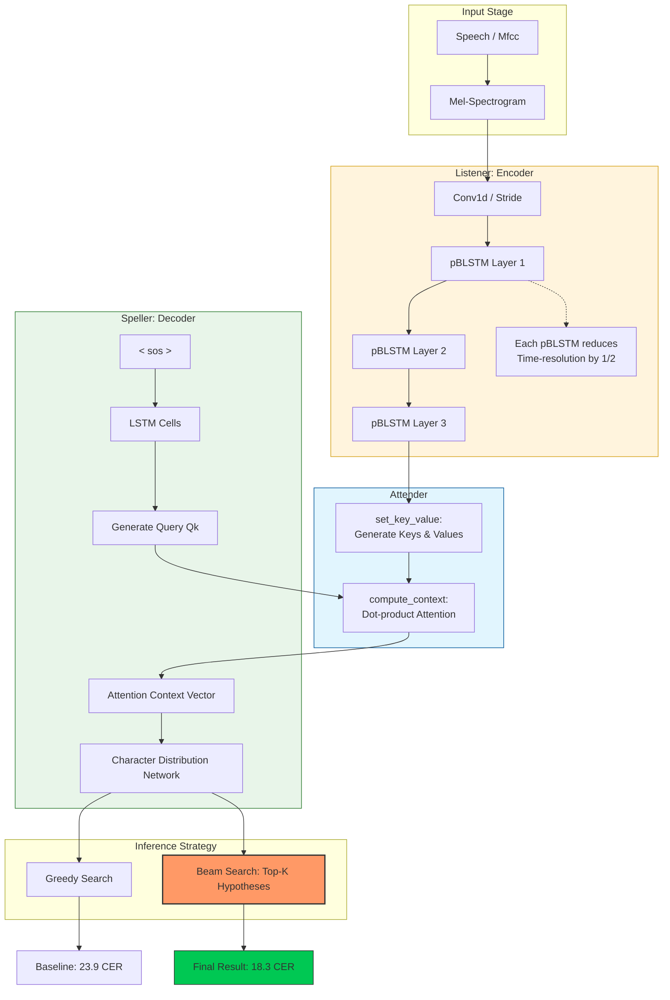

# End-to-End Automatic Speech Recognition (ASR) Model, (from Scratch)

**Listen, Attend and Spell (LAS)** 모델 참고, 처음부터 모든 구조 스스로 구현
- (Carnegie Mellon Univ. (CMU) 11-785 Deep Learning 강좌 HW4P2 참고)
- https://www.kaggle.com/competitions/attention-based-speech-recognition


## Model Architecture

</div> <p><b>▲ Encoder-Attender-Decoder을 거치는 end-to-end 구조</b></p> </div>


</div> <p><b>▲ Listener 내부 구조</b></p> </div>


</div> <p><b>▲ speller 내부 구조</b></p> </div>


## Best model
Validation Levenshtein Distance: 23.926

Validation Loss: 0.6045

Test Levenshtein Distance (Public): 18.3597 (Beam Search 적용 결과)

<div align="center"> <div style="border: 2px solid #e1e4e8; border-radius: 10px; padding: 10px; display: inline-block; background-color: #f6f8fa;">  </div> <p><b>▲ Kaggle 제출 및 스코어 확인 화면</b></p> </div>


## Key Improvements 


### 1. Architecture Enhancements
- **PBLSTM (Pyramidal Bi-LSTM)**: 시간 차원을 압축하여 긴 시퀀스 학습 효율 증대
- **Add one more layer of PBLSTM**: 인코더의 깊이를 늘려 음성 특징 추출 능력 강화
- **Conv1d Stride Tuning**


### 2. Training Strategy
- **Scaling Factor**: 그래디언트 소실폭발 방지
- **Staged Teacher Forcing Ratio**: 2 staged teacher forcing decay를 이용
- **Spec Augmentation**: Time Masking, Frequency Masking을 통한 데이터 증강


### 3. Inference & Attention
- **Attention Padding Masking**
- **Beam Search Implementation**: 단순 Greedy Decoding 대신 test시 beam search이용해 레벤슈타인 거리 감소


## Visualization & Analysis


### 1. Attention Map Analysis

| Epoch 1 (Initial) | Epoch 150 (Converged) |
| :---: | :---: |
|  |  |
| 학습 초기: 정렬이 형성되지 않음 | **학습 완료: 약간 대각선(Diagonal) 형태의<br>Alignment가 형성** |

**단**, LAS 기반의 구조에서는 완전히 attention자체에 의존하지 않으므로 대각선이 선명하게 생기기는 어려운 측면이 있음. 


### 2. Training Log and(Wandb)
**Best Model 훈련 로그**


<details>
<summary><strong> 모든 run 확인하고 싶은 경우 클릭</strong></summary>
<br>
RUNS
<br><br>

</details>


## Installation & Usage


### 1. Requirements
```bash
pip install -r requirements.txt
```


### 2. dataset download
!! kaggle 계정에서 API 생성 후 .kaggle 폴더에 업로드 필요 !!

```bash
# 1. Kaggle API 설치
pip install -q kaggle

# 2. 데이터셋 다운로드
kaggle competitions download -c attention-based-speech-recognition -p ./data

# 3. 압축 해제
unzip -q ./data/attention-based-speech-recognition.zip -d ./data
```


### 3. Train
config.yaml 파일에서 hyperparameter tuning 이후 학습을 진행(config.py는 건드리지 말기!)
```bash
python train.py
```


### 4. Test(Inference)
```bash
python test.py
```


## Project Structure
```
.
├── models/             # Listener, Speller, Attention modules
├── utils/              # Helpers, Metrics, Visualization
├── config.yaml         # Hyperparameter configuration
├── train.py            # Training script
├── test.py             # Inference script (Beam Search included)
├── dataset.py
└── README.md
```